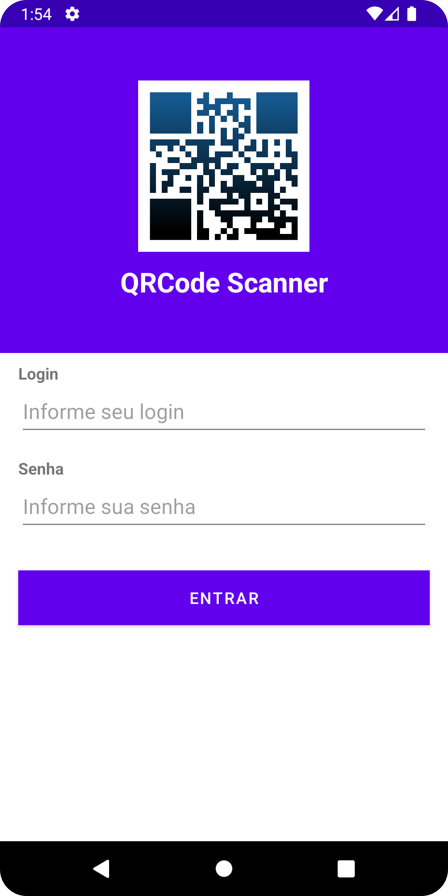
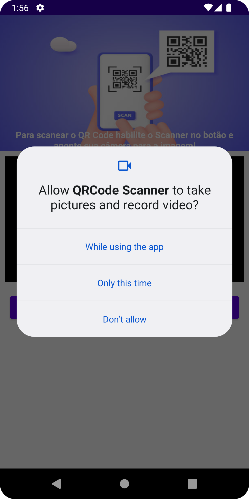
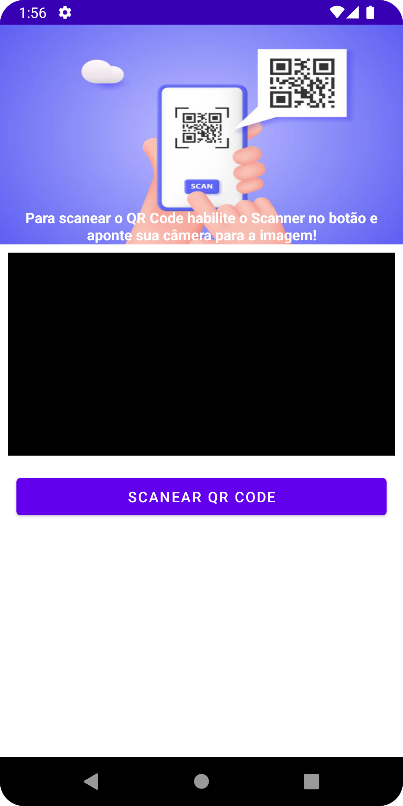

# QR Code Scanner

App de exemplo demonstrando como efetuar a leitura de QR Codes para dispositivos Android codificado em Java.  
Para desenvolvimento foi utilizada a lib [ZXing](https://github.com/zxing/zxing) para leitura dos QR Codes.  

## Licença

  

## Tecnologias utilizadas

  

## Dados de Autenticação

Os Dados de autenticação para login no App foram configurados como Login: Admin e Password: Admin  

## Pré-Requisitos

Para o correto funcionameto do App faz-se necessário a concessão da permissão para acesso a câmera do dispositivo, conforme exibino em um dos prints da tela do App abaixo.   

## Prints das Telas

